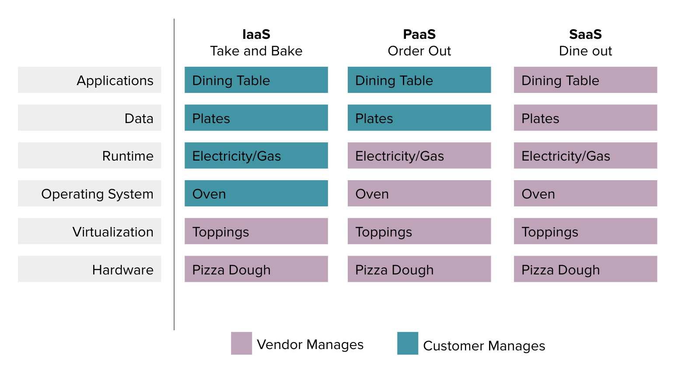

#  Cloud Essentials Training - Introduction to the Cloud

## Learning Objectives

*After this lesson, students will be able to:*

- Define cloud computing. 
- Compare and contrast virtualization and containerization and how they relate to cloud computing.
- Explain the benefits of cloud computing. 
- Differentiate between the main service models (SaaS, IaaS, PaaS).

## Lesson Guide

| TIMING  | TYPE  | TOPIC  |
|:-:|---|---|
| 5 min  | Opening    | Lesson Objectives/Tell the Story of "Why" |
| 10 min | Activity   | What Is the Cloud?    |
| 15 min | Lecture    | Virtualization and Containerization |
| 15 min | Activity   | What Makes It So Great? |
| 10 min | Lecture    | Cloud Service Models |
| 5 min  | Conclusion | Review/Recap     |

## Opening (5 min)

You’re the CEO of a travel agency that has branch offices in Taiwan, China, Japan, and the United States.

The vast majority of your company’s business — $30 billion TWD's ($974 million USD's) worth — is conducted via the website. Customers visit the website, review travel destinations, and book online. 

Your IT administrators need to make hardware and software updates that take the website offline periodically. This isn't ideal for a travel agency that services customers around the world in various time zones, but you deal with it. 

But then, during an effort to upgrade the security settings for the database that stores personal information about your customers (payment details, passport numbers, home addresses, etc.), your website’s performance is disrupted for two days. The two days down equates to around $35 million TWD ($1.13 million USD) in lost website revenues.

How do you prevent this from EVER happening again? 

The answer (at least in part) has to do with the cloud.

(*This is based on the true story of [SETTour](https://aws.amazon.com/solutions/case-studies/settour/).*)

-------

## What Is The Cloud? (10 min) 

Find a partner. Together, define "the cloud."

In addition to covering what it is at a high level, can you answer: 

- How does it work?
- How is it purchased? 
- What functionality does it provide? 

How did it go? Can someone share out their answers?

Cloud computing is on-demand computing resources delivered to you via the internet. 

Put roughly, a cloud is a series of computers that exists in a data center. These computers are strung together to create some sort of service. Resources are efficiently pooled together over a virtual infrastructure.

Basically, the cloud is just somebody else's servers.

## How Is This Possible? (15 min) 

There are two key concepts here:

- Virtualization
- Containerization

### Virtualization

Virtualization is the division of *physical* computing resources. It's what makes cloud computing possible. 

Through software called a *hypervisor*, virtualization slices the physical resources of a server (such as the RAM, CPU, and storage) and turns them into virtual resources. 

A physical server that's running a hypervisor is referred to as a virtual **host**.

Virtual **guests** run on a virtual host that provides all of the physical resources to the virtual machine to run the operating system and applications. As far as these applications and the OS are concerned, they are not aware if they are running on a VM or an actual physical server. 

A **virtual machine** (VM) is a software-based instance of a physical server running on a hypervisor where a guest operating system has access to emulated virtual hardware. 

Of course all this comes with a cost.

### Containerization

So, how does containerization relate to virtualization? 

A container is operating system-level virtualization where the OS kernel provides isolated user spaces to run specific applications. 

Instead of slicing physical resources, a container engine such as Docker slices operating system resources: process namespace, the network stack, the storage stack, and file system hierarchy. Every container gets its process IDs and root file system. As a result, containers are much more lightweight than VMs.

[Source](https://www.docker.com/what-container#/package_software)

We'll spend a lot more time talking about containers when we get into Docker, and we'll revisit the idea of Containerization at that time.

	
Check: What is the biggest difference between virtualization and containerization?

- In a **virtualized** environment, each virtual machine has its own guest OS. 
- In a **containerized** environment, the operating system lives on the physical server and the OS resources are split across each container. 

------

## What Makes It So Great? (15 min) 

Go back to your partner and brainstorm: Why do people get so excited about the cloud? What benefits does it provide for companies? Discuss for a few minutes and then we'll popcorn out as a group.

Here are some key benefits:

### Scalability

It is **scalable**. Cloud infrastructure scales much more quickly than onsite infrastructure.  Scalability can be accomplished by either adding or removing power to and from existing resources, or by adding additional identical instances of the same resources.  These two options are called:

- Scaling horizontally (or scaling in and out).  This option adds or removes identical instances of resources, typically to handle changing requirements for utilization of the applications (workloads). 
- Scaling vertically (or scaling up and down).  This option adds or removes power to an individual resource, such as additional memory, disk throughput, or CPU cores.  

> “With a capex model (owning the hardware onsite) it was a question of putting your finger in the air to anticipate shifting storage requirements. Now we can see what we need immediately and accommodate changes very easily in the most cost-effective manner.”	
(*Paul Brown, IT Director for Infrastructure and Support, Cordant Group*. [Source](https://cloud.netapp.com/hubfs/success-stories/Cordant.pdf).)

Think of buying a car versus renting one. If you buy a car, you're saddled with the expense until you pay it off. If you rent a car, you commit to paying for it as long as you want to use it; once you've paid for that use, you have no further obligation to pay! You only pay for what you use, just like with your water service or electrical utility.

### Elasticity

The cloud provides **elasticity**, allowing companies to scale resources with automation.

With Elasticity, your workloads can be configured to scale based on metrics.  For example, if you get too many requests within the last hour, your automation might scale horizontally to add additional instances to handle the load.  When the number of requests goes back down to a normal level, then automation scales back in and tears down any additional instances that are no longer needed.  

Other contributing factors for automation might be workday and non-workday/holiday loads that can be automated.  For example, if requests or low on the weekend, rules can be created to scale the resources down and/or in on Friday night and scale them back up/out on Monday morning.

> **Knowledge Check**: What kinds of business might benefit from elasticity? 

### It's a Service 

This is especially beneficial for smaller companies that may not have the required technical support onsite. Servers can be provisioned in a matter of a few clicks and disposed of just as easily. Cloud providers boast better uptimes than most businesses. 

> “By switching to the AWS Cloud, our uptimes went from around 95 percent to 99.999 percent. We no longer run the risk of downtime impacting revenues.”
(*Jinwei Lin, Assistant Manager, SETTour*. [Source](https://aws.amazon.com/solutions/case-studies/settour/).)

------
  
## Cloud Service Models (10 min)

Like pizza, there are many varieties of the cloud. We'll call these "service models."

Sure, you can make pizza from scratch, or you can "take and bake," or you can have it delivered! Let's compare these options to the most common cloud service models. 

*We did our best to find the chef of this analogy. We believe [Albert Barron](https://www.linkedin.com/pulse/20140730172610-9679881-pizza-as-a-service) deserves credit.*

Let's say we're feeling ambitious, so we're going to make a pizza from scratch. In this service model, we make the dough, add the cheese and toppings, cook it at home, and eat it at our own dining room table. This can be compared to the **traditional on-premise option**, where companies handle it all on their own: the hardware, the software, the management, all of it. (It's not in the diagram above.)

The next service level "up" would be like buying a "take and bake" pizza. The restaurant makes the pizza (composed of dough, cheese, and toppings), but you cook and consume it at home. This cloud service model is called **Infrastructure-as-a-Service (IaaS)** and is the most basic category of cloud computing.

Another step up, and we're getting pizza delivered to our home. The restaurant makes the pizza, cooks it, and delivers it to you. But... you still use your own plates and dining room table. This is called **Platform-as-a-Service (PaaS)**. Services like Amazon Web Services and Heroku are PaaS.

And finally, let's say you're feeling really lazy. You don't want to cook, you don't want to even clean the dishes, so you dine out. Dining out is the equivalent of **Software-as-a-Service (SaaS)**. These applications are typically accessed via the browser and often operate on a subscription model. Examples include messaging services and productivity software.
  
We don't have a pizza analogy for all examples of cloud computing-based "X-as-a-service." For example, there's Desktop-as-a-Service (DaaS), where you access virtual desktops in the cloud, or Storage-as-a-Service, whose only purpose is to allow you to store, access, and organize data in the cloud. 

-----

## Conclusion (5 min)

Remember when we asked you to define and describe several aspects of the cloud? Well, now you should be able to answer all of these questions:

- What is the cloud?
- How does it work?
- What are the different service models?

#### Resources 

- [More on Service Models](https://www.quora.com/What-are-cloud-computing-types)
- [More on the Financials](https://www.cio.com/article/2430099/capex-vs--opex--most-people-miss-the-point-about-cloud-economics.html)
