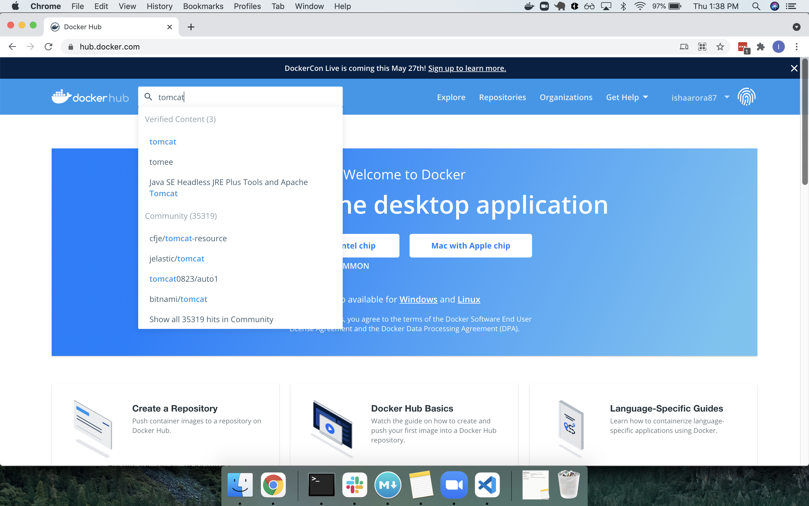
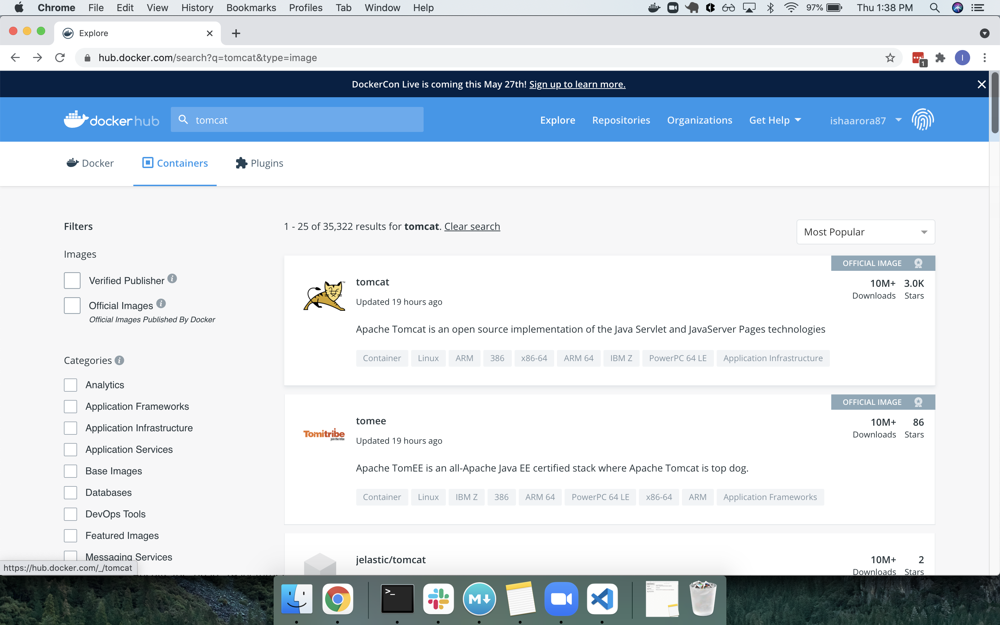
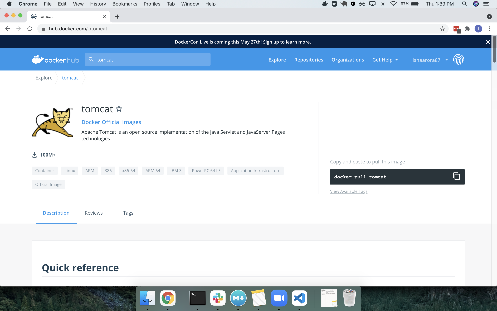

#  Power of Docker

### Learning Objectives

- Explain the container lifecycle
- List and run essential Docker commands

## Lesson Overview 

| Topic | Type | Timing |
| --- | --- | -- |
| Container Lifecycle       | Lecture | 15 min |
| Docker Commands       | Lecture | 40 min |
| Power of Docker | Exercise | 50 min |
| Conclusion | Exercise | 5 min |

## Container Lifecycle (15 min)

[Here is an online browser based Ubuntu playground if Docker is not working locally.](https://www.katacoda.com/courses/ubuntu/playground)

Before learning about Docker commands lets look at life of a container.

To start up a new container from an image we use `docker run` command. `docker run` creates a new container and starts it. But creating a container and starting it up are 2 different processes.

docker run = docker create + docker start

When a container is created the file system is prepped for use in the new container. To start the container means executing the startup command that comes with the image.

Lets see it in action. Open terminal and create hello-world image.

```bash
docker create hello-world
```  

This will output an id something like this, `2ce9bdb14238e8a6ba2ac68964ee8ca48e93e9cbf90d0c2c3f441d6be279e8b4`. This is the id of the container that just executed. 

Now run `docker start` with **your** container id [different than what is shown here because it's unique to your system].

```bash
docker start -a 2ce9bdb14238e8a6ba2ac68964ee8ca48e93e9cbf90d0c2c3f441d6be279e8b4
```  

>**Note:** `-a` makes docker watch for output from the container and print it out to the terminal. 


## Docker Commands (45 min)

### `docker run`

We have already run this command before, it runs a container

We can also give another command with run to override the startup command.  When running a docker container, replace the image name and commands as necessary in the following command:

```bash
docker run <image name> <command-to-override>
```  

Example, `docker run busybox ls` will list all the files in `busybox` image.

```bash
docker run busybox ls
```  

### `docker ps`

Lists all the different currently running containers. 

Go ahead run `docker ps` on the terminal. 

```bash
docker ps
```  

You may not see anything right now as there are no active containers. 

Next, Let's run `docker run busybox ping google.com`:

```bash
docker run busybox ping google.com
```  

Executing this command will keep pinging `google.com` for us and on another terminal run `docker ps`,

Now you *should* see something like,

```
CONTAINER ID   IMAGE     COMMAND             CREATED         STATUS         PORTS     NAMES
f7eea52fa97e   busybox   "ping google.com"   7 seconds ago   Up 6 seconds             jovial_nash
```
> Status shows the status of the container, if it is still up or exited.
> jovial_nash is a randomly generated name to identify this container.

Now `ctrl-c` on the terminal which is running the container and run `docker ps` again. You will again get no output.

`docker ps --all` will list all the containers you ever ran.

```bash
docker ps --all
```  

### `docker start`

Starts the docker container after it has been created. We can also start an exited container.

Run `docker ps --all`.

```bash
docker ps --all
```  

```
CONTAINER ID   IMAGE                                 COMMAND                  CREATED          STATUS                       PORTS                    NAMES
2ce9bdb14238   hello-world                           "/hello"                 52 minutes ago   Created                                               vibrant_benz
f7eea52fa97e   busybox                               "ping google.com"        17 hours ago     Exited (0) 17 hours ago                               jovial_nash
570646e6503c   busybox                               "ls"                     17 hours ago     Exited (0) 17 hours ago                               intelligent_lederberg

```

Find the hello-world container id. Use this id to restart the exited container.

`docker start -a 2ce9bdb14238`  

```bash
docker start -a <containerid>
```  

### `docker logs`

To retrieve logs of an exited or up container. All you need is the container id.

You can use the container id used previously or get a new one by running `docker ps --all`.

`docker logs 2ce9bdb14238`

```bash
docker logs <containerid>
```  

This will print all the logs emitted from that container.

### `docker stop` OR `docker kill`

If `ctrl-c` is not an option or even otherwise, in order to stop a running container we can use stop or kill command. They both stop the container with just one key difference. 

- `docker stop` sends a signal *SIGTERM* (short for terminate signal) to process in a container to shut down on its own time. Gives process time to do any clean up activities.  
- `docker kill` issues a *SIGKILL* (kill signal) message to the primary running process inside the container which means stop right now with no time for any clean up activity. 

If the container doesn't stop with `docker stop` you can always run `docker kill` instead. 

Lets try it. Run the ping command.

```bash
docker run busybox ping google.com
```  

This will keep the container running. 

Run `docker ps` to get its container id 

```bash
docker ps
```  

Use the container id to stop the container.

`docker stop 3ddc6041a39d`

It may take couple of seconds to stop the server. Now run the ping command again but this time use kill to stop the container. 

Docker internally uses kill to stop the process if stop command automatically is unable to in 10 seconds.

**Important Note** You can also give first few characters of the container id so long as it can uniquely identify the container. For instance you could also run the above command as `docker stop 3dd`.

### `docker image ls`

Lists all images in local image cache.

### `docker exec`

Another very useful command. This command runs a command in a running container. The command started using `docker exec` only runs while the container’s primary process is running, and it is not restarted if the container is restarted.

As it says we need to have a running container so start pinging google.com again (same command as above; hit the up arrow to just get it back).

`docker run busybox ping google.com`

Find the container id by running `docker ps` again.

```
CONTAINER ID   IMAGE     COMMAND             CREATED          STATUS          PORTS                    NAMES
56379bf033ff   busybox   "ping google.com"   27 seconds ago   Up 26 seconds                            upbeat_allen
```

We will use this command to acess 

```bash  
docker exec -it 56379bf033ff /bin/sh
```  

> **Note**: `-it` stands for Interactive Terminal

Now try `ls` or `cd`, whatever shell commands you want to try.  

Whenever you're done enter the command `exit` to leave the shell associated with your container. 

### `docker rm`

Removes one or more stopped container. Run `docker ps --all` to get the container id of a stopped container. Use any id to run `docker rm CONTAINERID`

```bash
docker rm <containerid>
```  

To remove a running conatiner use flag `-f` or `--force`. Go ahead try it.

```bash
docker rm <containerid> -f
```  

### `docker system prune`

This will delete all stopped containers and your image cache among other things. If run you will have to redownload images from docker hub the first time they are run.  

```bash
docker system prune
```  

Run `docker system prune` on the terminal. You will see something like,

```
WARNING! This will remove:
  - all stopped containers
  - all networks not used by at least one container
  - all dangling images
  - all dangling build cache

Are you sure you want to continue? [y/N] 
```  

Be very sure before running this command.

## Code Along: Power of Docker (50 min)

Lets see the real magic of Docker.

First go to docker hub and if you don't have an account [signup](https://hub.docker.com/signup). If you created an account while installing Docker use the same credentials.

### Search for Tomcat

After signup/login, search for tomcat in the search bar at the top. 



[Apache Tomcat](http://tomcat.apache.org/) provides a "pure Java" HTTP web server environment in which Java code can run. It is a web server used to run Java based web applications. 

Select the tomcat at the top.



We don't care how Tomcat works or what Java is, we only care about tomcat's ability to run a web app. We are going to get 2 different versions of tomcat and run them simultaneously.




### `docker pull`

As it is shown, executing `docker pull tomcat` will get the latest version of tomcat image that we can use to run a container. `docker pull` is used to pull an image or a repository from a registry.

Run `docker pull tomcat` to pull tomcat from docker hub. 

```bash
docker pull tomcat
```  

You will get something like,

```
Using default tag: latest
latest: Pulling from library/tomcat
Digest: sha256:a655be865e9f62d6d2ed3823c7382a2d77d0a034eb17714bbf2a514c3f620717
Status: Downloaded newer image for tomcat:latest
docker.io/library/tomcat:latest
```

### `docker run`

We will now run tomcat using docker image, exposing tomcat on port `9090`.  

```bash
docker run -p LOCALPORT:DOCKERPORT IMAGEID
```  

> `-p` flag on docker run to publish and map one or more ports

Open a new tab on the terminal and run 

```bash
docker run -p 9090:8080 tomcat
```  

Instead of `9090` you can give any unused port number. Why `8080` though? Because by default tomcat runs on port `8080`, and you are mapping your port such as 9090 to connect to the exposed port 8080 for the tomcat server.

Now you may be thinking, what's a [port number](https://searchnetworking.techtarget.com/definition/port-number)? 

In the simplest terms, a port number is an address to where our app is running on the server. In our case the server is our laptop/personal computer and the port that our app will run on is `9090`. 

### `docker ps`

Now that our container is running, we now need get it's container id in order to deploy our web app on tomcat.
 
```bash
docker ps
```  

```
$ docker ps
CONTAINER ID   IMAGE     COMMAND             CREATED          STATUS          PORTS                    NAMES
21e06818be84   tomcat    "catalina.sh run"   42 seconds ago   Up 40 seconds   0.0.0.0:9090->8080/tcp   priceless_margulis
```

### `docker exec`

We will use this command to copy our war file into the running tomcat container. You will find `JavaWebApp.war` file to be [here](./resources/). 

`$ docker exec -i 21e06818be84 bash -c 'cat > /usr/local/tomcat/webapps/JavaWebApp.war' < <path-to-war-file>`

```bash
docker exec -i <containerid> bash -c 'cat > /usr/local/tomcat/webapps/JavaWebApp.war' < <path-to-war-file>
```  

>**Note:** `-i` is for interactive  
>**Note:** `-c` means copy

Lack of output after running this command means it's successful. If you go back to the terminal where tomcat is running, you should see logs like,

```
19-Apr-2021 20:23:08.885 INFO [Catalina-utility-1] org.apache.catalina.startup.HostConfig.deployWAR Deploying web application archive [/usr/local/tomcat/webapps/JavaWebApp.war]
19-Apr-2021 20:23:09.514 INFO [Catalina-utility-1] org.apache.catalina.startup.HostConfig.deployWAR Deployment of web application archive [/usr/local/tomcat/webapps/JavaWebApp.war] has finished in [628] ms
```

This means that the app is deployed on tomcat. Now to test go to link [http://localhost:9090/JavaWebApp](http://localhost:9090/JavaWebApp/). What do you see?

>**Note:** Server name is `localhost` and port number is `9090`.


This means that we have successfully pulled an image from docker hub. Ran a container using it and deployed an app on it.

### You Do

We still haven't seen the true power of Docker. We could always install tomcat web server as an application on our machine and deployed any web application on it. So why really use Docker? Well, lets find out.

Pair up for this activity. *Two minds are better than one.* For this exercise you will run two different Tomcats in parallel.

- Go back to docker hub.  

- Go to the [Tags](https://hub.docker.com/_/tomcat?tab=tags&page=1&ordering=last_updated) tab to find another version of tomcat  

- Pull any tomcat image, except for the latest one(as we already have that image). For instance `docker pull tomcat:jdk11-openjdk`  

- Just like before, run the new tomcat. Make sure to run it on a port other than `9090` as this port is already occupied.  

- Run `docker ps` to get the container id of the new Tomcat.  

- Deploy the war file `JavaWebApp.war` on this Tomcat.  

- Check the localhost link. Don't forget to use the new port number.  

> Quick Question: Why in this image `tomcat:jdk11-openjdk` jdk which is Java Development Kit bundled with Tomcat? Answer: Tomcat itself is a Java based application that is why it needs jdk (Java Developement Kit) to run.  

Do you see the awesomeness of Docker yet? We now have 2 different versions of Tomcat running simultaneously without conflicting with each other at all. They may or may not have same or different applications deployed on them. 

More importantly we all can run `JavaWebApp` on the same environment by using the same image of Tomcat. Can you think of any use case where this ability can become a super power for developers, testers and devops?

### No more machine-based issues

From now on, there should be no more "but it works on my machine" statements!  

With docker, everyone is running the app on the same environment with an agnostic approach to the underlying host operating system.
