#  Docker Containers In Azure

# Learning Objectives

- Azure Container Registry (ACR)
- Pushing and pulling images to and from ACR
- Azure Container Instances (ACI)
- Hosting a containerized application using ACI

# Lesson Guide

| TIMING  | TYPE  | TOPIC  |
|:--|---|---|  
| 5 min  | Overview | Containerized applications in the Azure ecosystem |  
| 15 min | Lecture | Azure Cloud-Native PaaS Offerings |
| 60 min | Activity | Creating and utilizing ACR and ACI for containerized applications |  

# Overview  

To this point, you've learned about containerized apps using Docker and Docker Desktop.  You've also seen an introduction to Azure platform services as they would traditionally be used to host a web application. In today's training, you'll learn about using containerized applications and Azure platform services together to create a modern cloud-native application.   


Containerized applications are not only useful for moving your production workloads to the cloud, but they are also useful for microservice architectures.  Additionally, the elasticity and scalability of the cloud in combination with the portability of containers give you and your team the ability to create powerful and effective solutions quickly. Since the applications are containerized, you also have the flexibility to move between services in any cloud, or even to other cloud platforms if the need should arise. 

As usual, should you desire to have even more control over underlying architecture, you could even deploy the solution on an IaaS backbone, such as a fleet of VMs behind a load balancer inside a virtual network.  However, the focus of the remainder of this training will be on utilizing platform services at Azure.  

## Azure Cloud-Native Application PaaS offerings.

Within Azure, you can create a containerized application that runs on any of three different platform services.  

### Azure App Service (App Service)

One of the options to deploy a containerized application on an Azure platform service is the `Azure App Service`, you've already learned about.  

While the first look at this service showed the traditional approach of utilizing the App Service as a platform for traditional web development, the other option is to deploy the application to the App Service as a containerized application.  

When you use this approach, you get all the compute power and ability to work with the Azure application service while also easily hosting your containers.  

#### Deploy and run a containerized web app with Azure App Service 

There is not enough time to work with all three options.  For this reason, the use of Azure App Service to deploy and work with containers is not in scope for this training.  However, [this learn module on deploying and running container app service](https://docs.microsoft.com/en-us/learn/modules/deploy-run-container-app-service/) is a great opportunity to learn on your own if you would like to try it out.   

### Azure Container Instances (ACI)

The first place that you should look when learning about deploying containerized applications to Azure is Azure Container Instances (ACI).  The ACI offering at Azure gives you the ability to quickly and easily deploy a containerized application that lives with one container or a small container group and doesn't require a lot of overhead or have an extremely high workload. 

ACI gives you the ability to quickly deploy your solutions, and has the ability to directly integrate with the Azure Container Registry (ACR).  You can then easily push images to your ACR and deploy changes to your ACI instance.  You will get a chance to see all of this in action soon!

More information about ACI can be found in the [Azure Container Instances Documentation](https://docs.microsoft.com/en-us/azure/container-instances/)  

### Azure Kubernetes Service (AKS)

In a production workload, you'll likely need to use something more powerful than ACI or the Azure App service to orchestrate and manage your containers.  For example, consider a workload with thousands of containers running.  In this case, you want the ability to easily manage the lifecycle of containers, perform health checks on the containers, and ultimately be able to scale appropriately to your workload needs.

In this case, you will want to leverage the full power of Azure Kubernetes Service (AKS). Day 7 of this training will be devoted to learning how to leverage and work with AKS.  Additionally, the final lab activity will give you the chance to put it all together for building out a production-ready application utilizing AKS.  For this reason, this lesson won't talk more about AKS at this time.

### Azure Container Registry (ACR)  

Earlier in the course you were exposed to working with Docker containers, and at one point you likely pulled and/or pushed container images to DockerHub.  DockerHub has traditionally been the most common platform to work with container images. Truly you will find most public container images are hosted at DockerHub.

In your private organization, you really have two options. The first option is to utilize DockerHub and create a private registry there. In fact, if you already have a private registry at DockerHub, you may desire to continue utilizing DockerHub as your container registry.

However, you may find that you want a bit more control and segregation for your images. At Azure, the Azure Container Registry (ACR) is a platform service that functions just like DockerHub - as a centralized repository for your organization's images.  The advantages to using ACR are that this is a unique registry that is only for your organization.  You will have full control over all access to the images.  You can even restrict access to your ACR to a private network, making it even more secure.

Like Docker itself, container registries have a bit of a learning curve.  While being similar to a Git repository with push and pull commands, as well as versions, the interaction with a container registry is a little less obvious as you must leverage tags to utilize the repository, rather than having branches and commit histories.  Tags (versions) on your images allow you to have multiple instances available for deployment.  This does give you quite a bit of power.  However, we all know:  

  

## Code Along and build out the environment  

In the next few activities, you will build out a containerized application and then work though the steps to deploy the application to Azure Container Instances, with your image hosted on Azure Container Registry.  

As the learning progresses, concepts will build on things already learned and failure to complete a section will likely result in the inability to complete consecutive sections.  Therefore it is recommended that you do not skip ahead, but rather work through the activities as they are presented.  

> **Note:** The remainder of this work requires access to an Azure subscription.  Do not delete resources after creation as the work builds on itself as it goes.

## Activity: Build and store container images with Azure Container Registry

This first activity will walk you through getting your application built and deployed to the Azure Container Registry (ACR). 

### Prerequisites

In order to complete this activity, you must have either `Visual Studio Code (VSCode)` or `Visual Studio (VSCommunity, VSPro, VSEnterprise)` installed on your machine.  Since this will be run in a container, you will not need to install any additional SDKs on your machine. 

If you do not have `VSCode` or `VSCommunity`, both are free.  You can download the tool of your choice.  As most of the work will not be with the actual code but will be around working with Docker and Azure, the recommended tool for this training is Visual Studio Code.

Ensure you have one of the following:  

- [Download Visual Studio Code](https://code.visualstudio.com/download)  
- [Download Visual Studio Community](https://visualstudio.microsoft.com/vs/community/)

Ensure you have Docker and Docker Desktop working on your machine.  

> **Important:** By this point in the training, it is assumed you have already learned about and have Docker working on your local machine.  If you do not have Docker and/or you are not able to create and work with images, then you should go back and work through the documents for [Introduction to Docker](03_docker-intro.md), [Docker Installation](04_docker-installation.md), [Docker Commands](05_docker-commands.md), and [How to Dockerize with 
> Dockerfile](06_dockerfile.md).  

### Step 1: Get the starter project for working with a .Net web application  

The starter project will be easily accessed from this repository, and will be posted into the slack channel to give the ability to easily download the source file.  

[SimpleTravelAgencyProtoWeb](https://git.generalassemb.ly/mtbank/cloud-native/raw/master/SimpleTravelAgencyProtoWeb/SimpleTravelAgencyProtoWeb.zip)  

### Step 2: Extract the contents of the file and build and run the prototype website locally

Before doing anything at Azure,  it's a good idea to ensure that everything works locally.  

#### Step 2.a Extract the file  

Extract the starter files to a folder that makes sense on your local machine.  Once the files are extracted, open Visual Studio code to that folder so that you can review the files.  

Additionally, open a Terminal to the folder root where the `SimpleTravelAgencyProtoWeb.sln` file resides.  

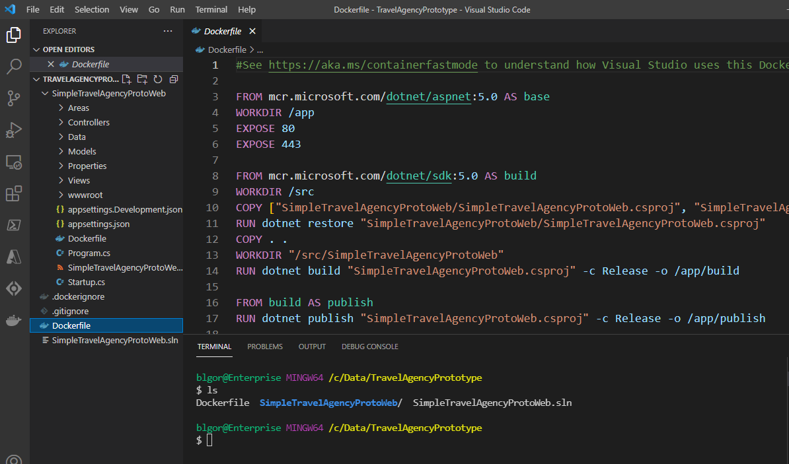  

#### Step 2.b Build the local image  

To build the local image, run the following command:  

```bash
docker build -t simpletravelagencyproto .
```  
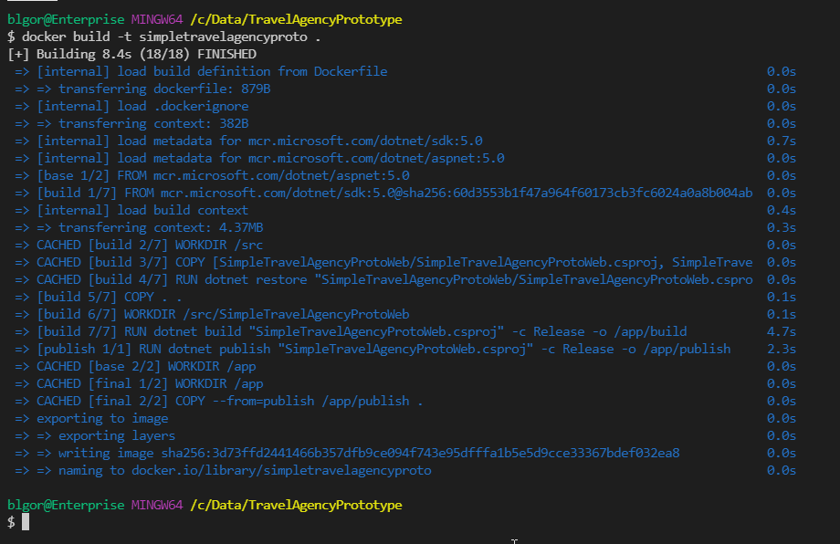  

Wait for the command to complete, then validate the image is listed in your `Docker Desktop client`.  

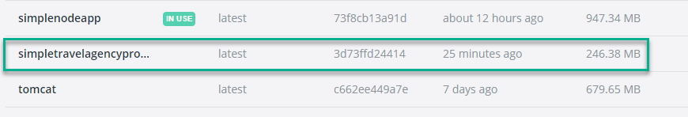  

> ***Question:*** Do you remember what the docker command is to see your images locally?

Answer:  

```bash  
docker image ls
```  

With the image built, it's time to run it locally and ensure it works.  

#### Step 2.c Run the image locally  

Use the docker start command or utilize Docker Desktop to start a new container based on the image.  Map ports that make sense and don't conflict with anything on your device.  

>**Note:** You will need to expose port 80 in addition to port 443 unless you want to go through the process of installing a local SSL certificate  

Find your image, and use the `Run >` button.  

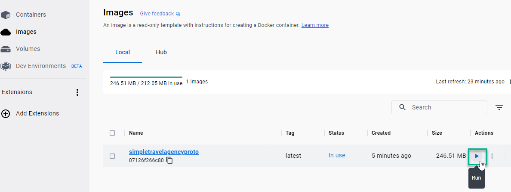  

Expand the `optional` settings.  If you would like, you can set a container name, but you do not need to.

Make sure to set the port for 443 to something that is not in use, like `8081`.  

  

Add a second port using the `+` sign for port `80`, set to port `8082` (must be unique and not in use).  

  

Run the container once you have the ports configured correctly.  

#### Step 2.d Ensure the container works locally

To finalize this step, ensure the container works locally.  

On `Docker Desktop`, navigate to your running containers and use the `browse` button to open the container locally in a browser.  

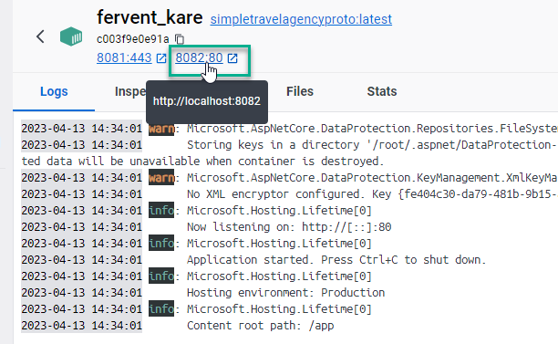 

This will open to the port 443 instance, which will not work.

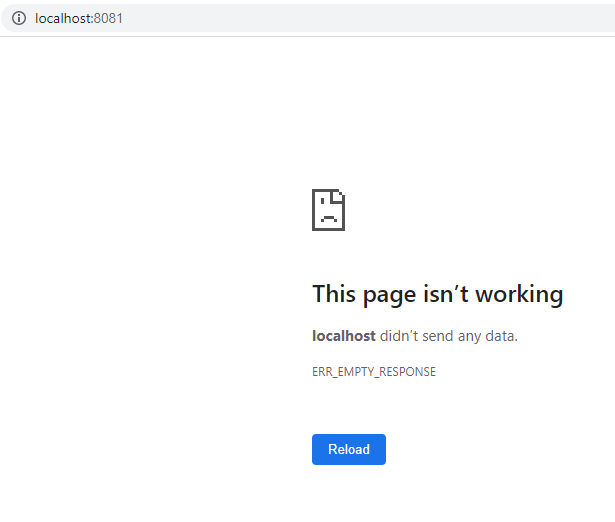  

Change the type to `http` and the port to `8092` and you will be able to view the site

```text
http://localhost:8082
```  

>**Note:** Failure to change https to http will continue to show the site is not working.

  

### Step 3 - Create an Azure Container Registry in the Azure Portal, and push your image to the ACR

To begin, you will need to log in to your Azure Subscription.  Once you are logged in, you will need to have a resource group where you will create your resources.  

#### Step 3.a - Ensure your resource group

Open the azure portal and browse to the resource groups by typing the following into the search bar at the top

```text
Resource Group
```  

  

Once you are on the Resource Groups listing, ensure a group exists with <yourname>-rg as the name of the resource group.

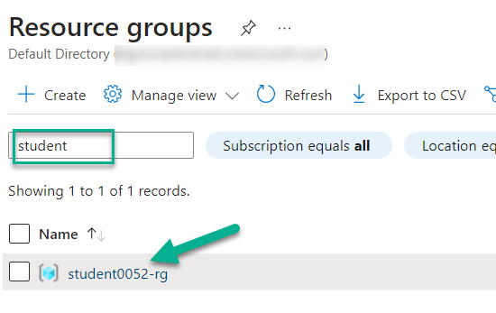  

If no group exists with your name, create one using the `+ Create` prompt at the top menu on the listing.  If you cannot create one, ask your instructor to create a resource group for you.

#### Step 3.b - Create the ACR

In this step you will create an Azure Container Registry to store your docker images.

It is possible to complete this operation using the Azure CLI commands.  However, it is likely easier and more intuitive to do this in the azure portal.

For reference the following command would create an ACR:  

```bash  
az acr create --name <any-unique-acr-name> --resource-group <any-rg> --sku <the-sku> --admin-enabled true --subscription "<your-subscription-id>"
```  

However, to do this, you would need to know the subscription Id and you would also need to know the name of your resource group, or first create a resource group and also get the subscription Id.

For simplicity, just open the portal at Azure if you don't already have it open.  

To create an ACR, type the following into the search bar at the top menu in the portal:

```text
Container Registries
```  

Select the `Container registries` item from the dropdown.  

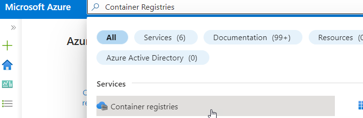  

At the `Container registries` blade, select `+ Create` to begin the process of creating a new container registry.  

1. Set the `Basics`  

    On the basics blade, select the subscription, and your resource group.  

    For the details, create a registry with a name such as

    ```text
    myacrYYYYMMDDzzz
    ```  

    Replace `YYYYMMDD` with the year, month, and day, and `zzz` with your initials.  This *should* ensure a unique name.  

    Select a region close to you, and change the `SKU` to `Basic`. 

    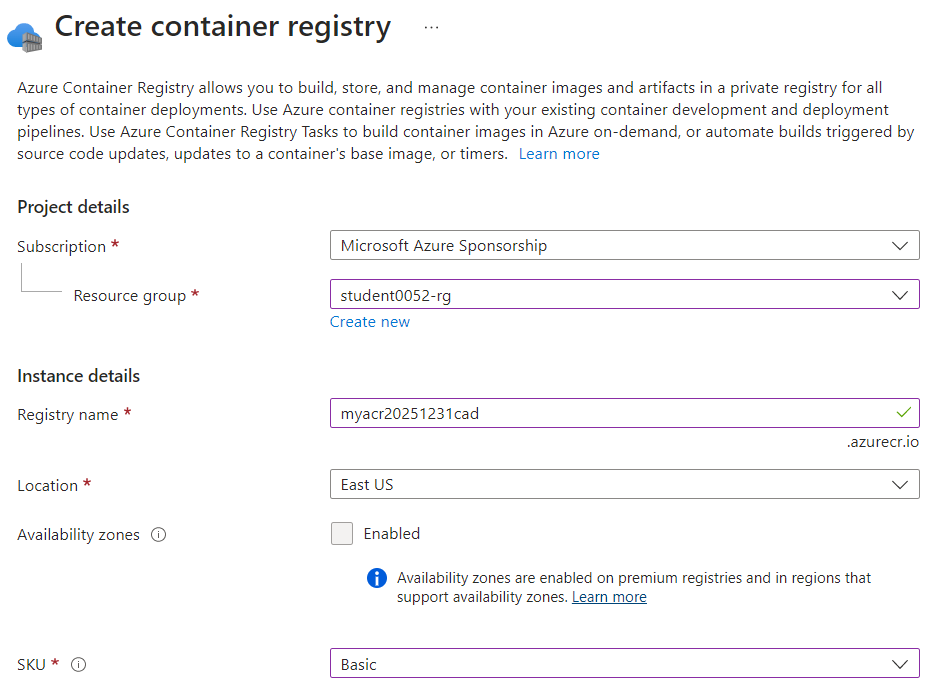  

    Select `Next: Networking -> `  

1. Review the `Networking` blade.  

    Note that this blade gives you the ability to set a private network.  Private networking is only available on the `Premium` sku.  If you needed to secure your ACR in a private network, you would need the premium tier and you'd have to create a private link to the ACR.

    hit the `Next: Encryption -> ` button.

1. Review Encryption options

    Note that you must use encryption. Your only option here is to leverage your own personal key vs. an Azure-backed key.  Once again, to use your own key, you must be on the Premium SKU.  

    Hit the `Review + create`.  While you could tag any resource, there is no requirement to do so.

1. Review and create the registry.  

    Once validation passes, hit the `Create` button, then wait for the deployment to complete.

    When the deployment completes, hit the `Go to Resource` button.  

    You will then see your ACR is created and ready to be used:

    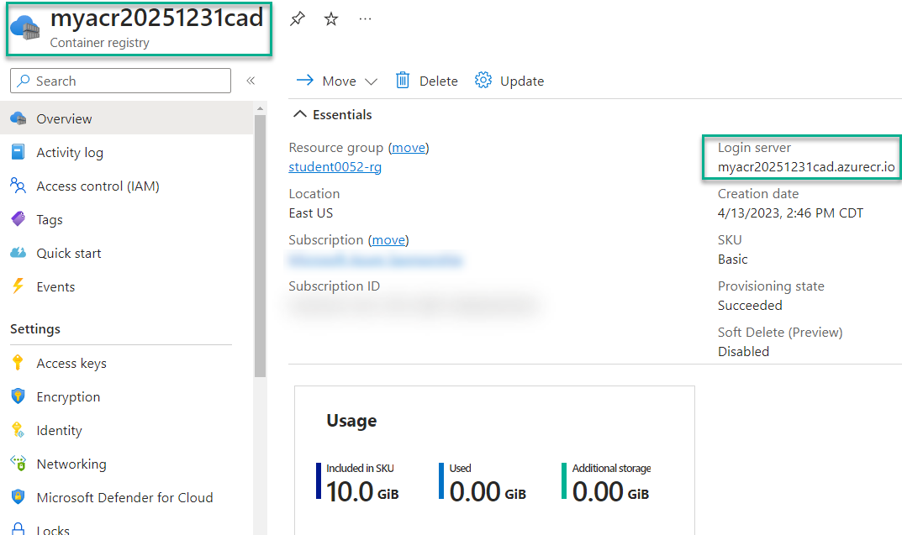  

    Before going to the next step, you will want to get a couple of pieces of information.  To do this, you will want to enable the Admin user. 

    On the left menu, select `Access Keys`.  When the blade shows, use the slider button to enable the Admin user.  This will give you the admin credentials.  

      

    Note that the registry name and the username are the same.  Note that the Login server is the registry name with `.azurecr.io` at the end.  

    Copy the username, password, and login server for use later.  For  now, just paste into notepad or some other tool that lets you quickly retrieve these values later.  

### Step 3.c - Alias your image and push to the ACR  

In this step you will alias a local image and push the image to the ACR.  You will then create another image with a specific version number and push that to the ACR as well.  

1. Connect to Azure from the command line.  

    With your image created locally, and the ACR created at Azure, it's time to push your image from your local device to the cloud registry.  

    The first step in this process is to get logged into your account, and to make sure you have the Azure CLI installed.  

    Open any powershell, bash, or other terminal.  In order to connect to Azure, you will want to have the Azure CLI installed.  In your terminal/bash/powershell window, run the command:

    ```bash
    az --version
    ```  

    If you have the `Azure CLI` installed, you will see the version number, such as 2.28.0

    Ensure that you see output that indicates you have the Azure CLI installed.  

      

    If you do not have `Azure CLI`, [use this link to install it.](https://docs.microsoft.com/en-us/cli/azure/install-azure-cli)

    You may install on `Bash` or on `Powershell`, whichever flavor you prefer.

    If you are on windows, [this direct link](https://aka.ms/installazurecliwindows) will download the MSI Installer, which you can run to install the Azure CLI on your machine.

    Sign in to your Azure account by opening a browser to the [azure portal](https://portal.azure.com):

    ```https
    https://portal.azure.com
    ```  

    You may not need to do this, but this will ensure that when you log in with the az command you will already be signed in on the portal via the browser.

    Run the following command in your terminal:

    ```bash  
    az login
    ```  

    Likely a browser will open and you will need to authenticate:

    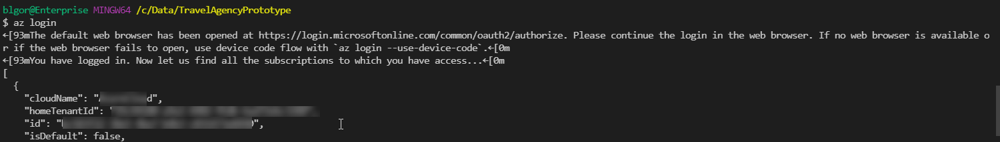

    If you only have one subscription, you can skip to the next step.

    If you have more than one subscription, ensure that you are on the correct subscription for your account.  

    ```bash
    az account list --out table
    ```

      

    If you have multiple subscriptions, they will be listed.  You can then select the correct subscription.  

    ```bash
    az account set --subscription <your-subscription-id>
    ```  

    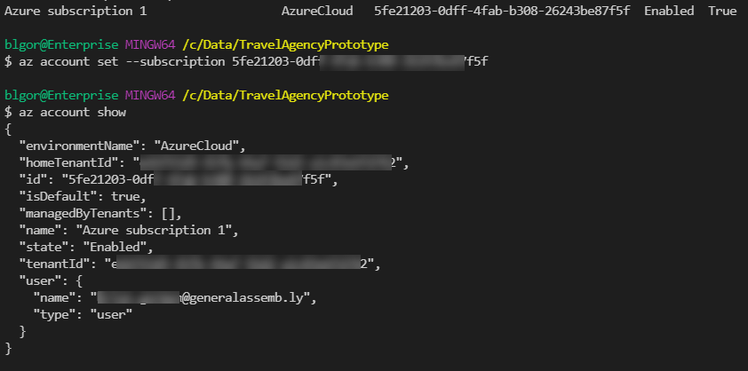  

2. Log in to your ACR.

    Now that you have logged in to Azure, ensure you are also logged into your ACR from the terminal.  Using the name of your registry that you copied earlier (your admin username is the same value), run the following command replacing `your-registry-name` with your admin username/registry name

    ```bash
    az acr login --name your-registry-name
    ```  

    If prompted, you may need to enter credentials.  If not, you will immediately see `Login Succeeded`.  


3. Create a local alias of the image with the correct information from your Azure Container Registry.  

    To continue, you must build an image that will be able to be pushed to your container registry.  

    Currently, you should have a local image for `simpletravelagencyproto`.  You will need to rebuild the image but ensure that it is aliased and versioned for deployment to your ACR.  
    
    To do this, in the terminal where your Dockerfile is, run the following command (don't forget to set the registry name correctly):  

    ```bash
    docker tag simpletravelagencyproto your-registry-name.azurecr.io/simpletravelagencyproto
    ```  

    Then run the command to list your images and/or review in Docker Desktop.

    ```bash
    docker image ls
    ```  

    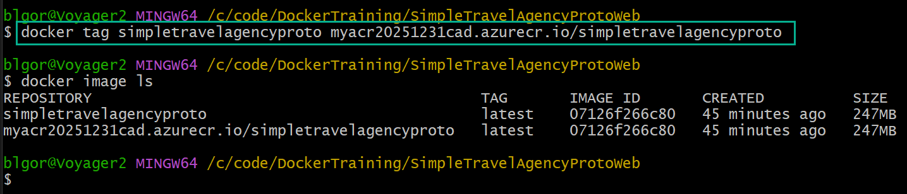  

4. Push the image to the ACR.

    With your account connected and the image successfully created, you are finally ready to push to the ACR.  To do this, just run the docker command to push:

    ```bash
    docker push your-registry-name.azurecr.io/simpletravelagencyproto
    ```  

      

    >**Note:** Since the image has no version, the default of `latest` is used.  

    Return to your ACR in the portal and review your images by selecting `Respositories` on the left menu.  You should see your image is now in the ACR and is ready to be deployed to an Azure platform service.  If you click on image in the portal, you can see more information.

    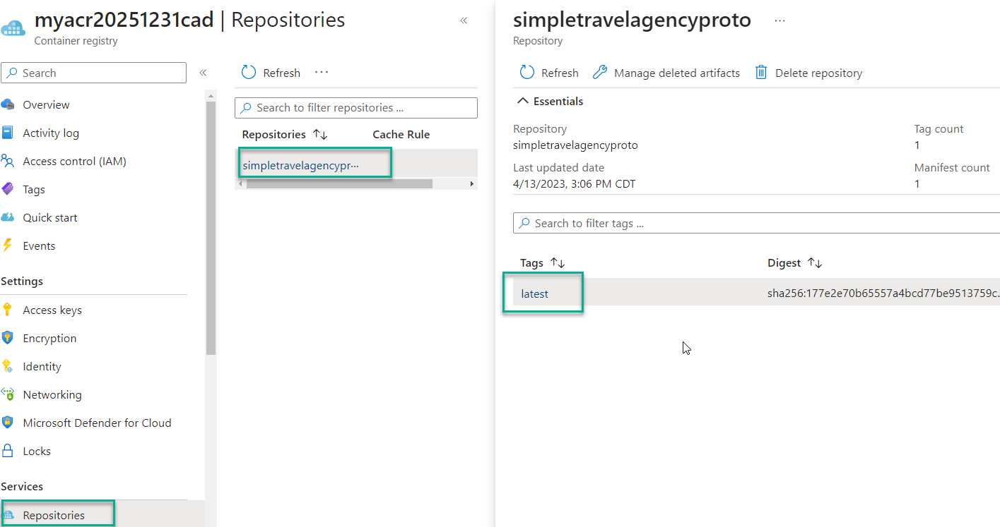  

    Note that this is the latest version.  Since you will likely update this in the future, it is a good practice to create a version tag.  Pointing to the latest can have some adverse effects if someone pushes a new image and it is not backwards compatible with what you are expecting.  

5. Create a new version tag on your local image and push to the ACR.  
   
    In the terminal, run the following command, making sure to replace the name of the ACR with your ACR name as before:

    ```bash
    docker tag simpletravelagencyproto your-registry-name.azurecr.io/simpletravelagencyproto:v1
    ```  

    This is the same command as before with a `v1` tag on the end.  Review your local images:   

    ```bash
    docker image ls
    ```

    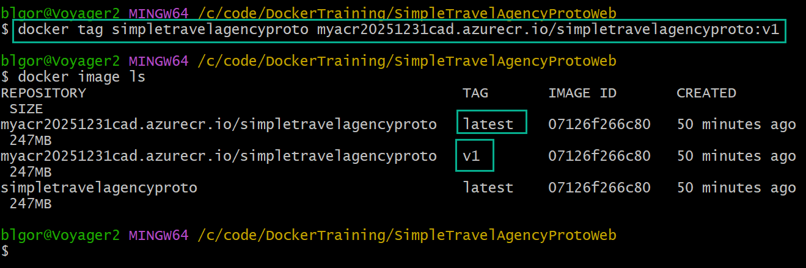  

    After you are sure the image is there, push the `v1` version to your ACR with the same command as before and the additional `v1` tag:  

    ```bash
    docker push your-registry-name.azurecr.io/simpletravelagencyproto:v1
    ```

      

    The good news is that this time you don't have to wait for all the layers to push, since you already did that on the first push and nothing has changed.

    Finally, review the repositories in the portal again (you may need to refresh).  Why do you think you only see one image in your repository?  

    Click on the repository to reveal that the answer is that each version is listed on the image blade, not in the repository as a separate image.  

      

### Step 4: Crate the Azure Container Instances (ACI)  

In this step. you will create an Azure Container Instances deployment which leverages your ACR to automatically host the `simpletravelagencyproto` image in a container.  

1. Start the process to create an ACI.  

    In the search at the top of the portal, type `container instances`.  Then select the appropriate item from the dropdown. 

    On the `Container instances` blade, select `+ Create` or `Create Container Instances`.  

    Use the following on the `Basics` tab:

    Subscription: `your subscription`  
    Resource Group: `your resource group`  
    Container name: `simpletravelagencywebYYYYMMDDzzz`
    Region: `your favorite region`
    Image Source: `Azure Container Registry`  
    Registry: `Select your registry`  
    Image: `simpletravelagencyproto`
    Image tag: `v1`  
    OS Type: [automatic, can't change]
    Size: Leave as is - `1 vcpu, 1.5 GiB memory, 0 gpus`

    select `Next: Networking >`  

    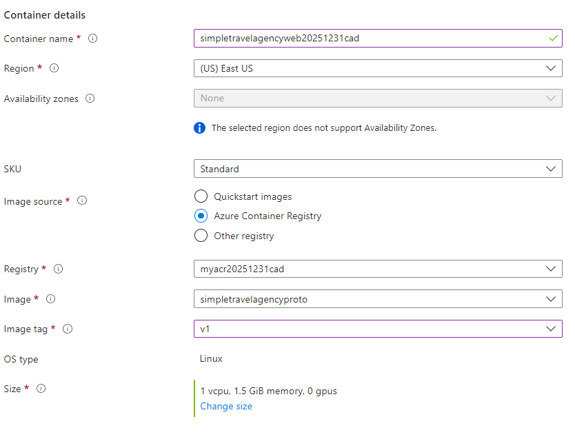 

    Note the options available on the networking tab.  Note the DNS Label, and note the port mappings.  As expected, port 80 is mapped by default.  

    There is no need to change anything.  Hit the `Next: Advanced >` button.  

    Note how on this tab you can select a restart policy and add additional environment variables, including secure variables.  

    Finally, note there is a command override to let you execute a command on startup.  

    Once again, leave everything as-is and hit the `Review + create` button.  Once your ACI is validated, hit `Create`.  

      

    Wait for the deployment to complete.  

1. Review the deployed containerized application.

    Once the deployment is successful, you can easily see your application working by browsing to the public IP for your ACI.  

    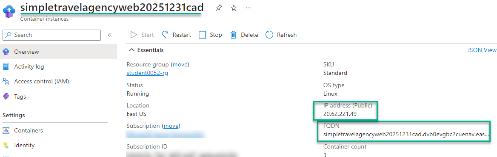  

    If you browse to the public-facing URL at this time, your deployment should be working.  If the deployment is not working, wait a minute or two and try again.  The first load may just be taking too long.  

    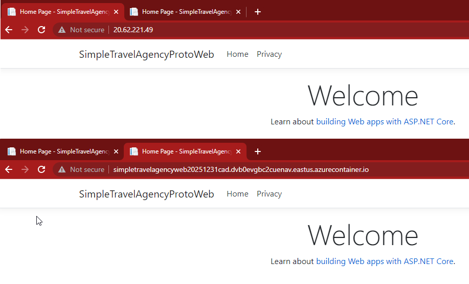  

### Step 5: Review the ACI instance.  

This exercise has been a great activity to learn about the ACI when everything works on the happy-path.  However, life is not always so easy.  What do you do if things don't work?  

Take a minute to review the ACI blade in the portal, and look for ways you might be able to see where things are not working.  

At some point, ensure that you click on `Containers`.  This will bring up a very handy review blade.  

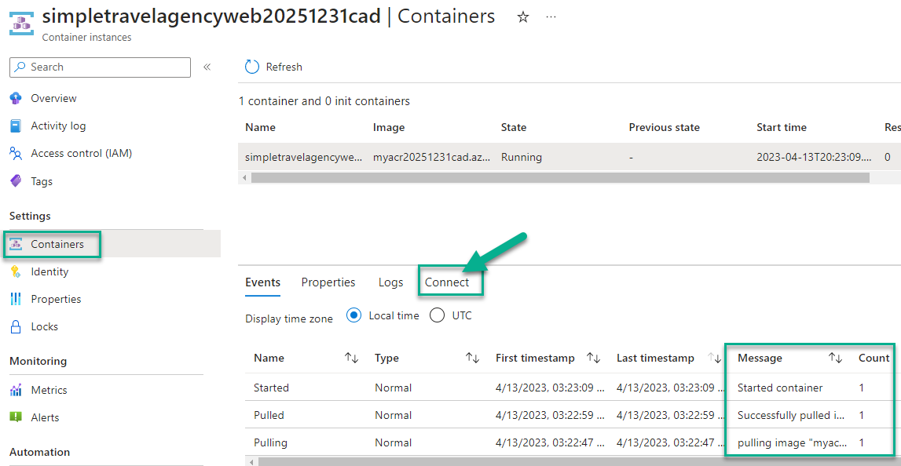  

On this blade, note that the container lifecycle is shown, where you could see if it was started correctly.  Additionally, note the tabs for `Properties` and `Logs`.  Clearly `Logs` would be useful for debugging.  

Select the `Connect` tab to see how you can connect to the running container from within the portal.  

  

Use the `bin/sh` connection to review the internal state of the container. 

  

As you've seen in previous days, you can attach to the running container and run linux commands on the container itself for troubleshooting.  

## Additional Resources and Practice  

[Quickstart: Deploy a container instance using the Azure Portal](https://docs.microsoft.com/en-us/azure/container-instances/container-instances-quickstart-portal)  

[Deploy a container application to Azure Container Instances](https://docs.microsoft.com/en-us/azure/container-instances/container-instances-tutorial-deploy-app)  

[Build a containerized web application with Docker](https://docs.microsoft.com/en-us/learn/modules/intro-to-containers/)

[Build and store container images with Azure Container Registry](https://docs.microsoft.com/en-us/learn/modules/build-and-store-container-images/)  


## Conclusion 

Today you've had a quick overview of the ACI and ACR and have had a chance to wire everything up with a working container on the happy-path.  
