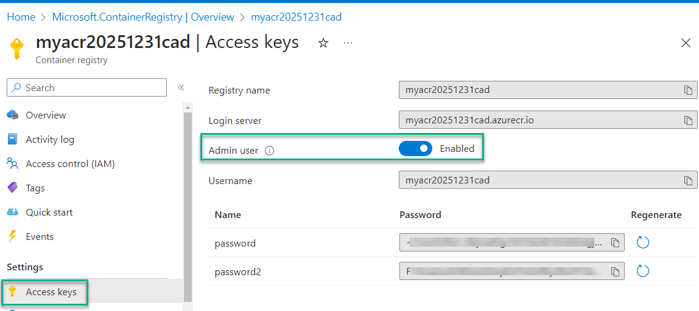
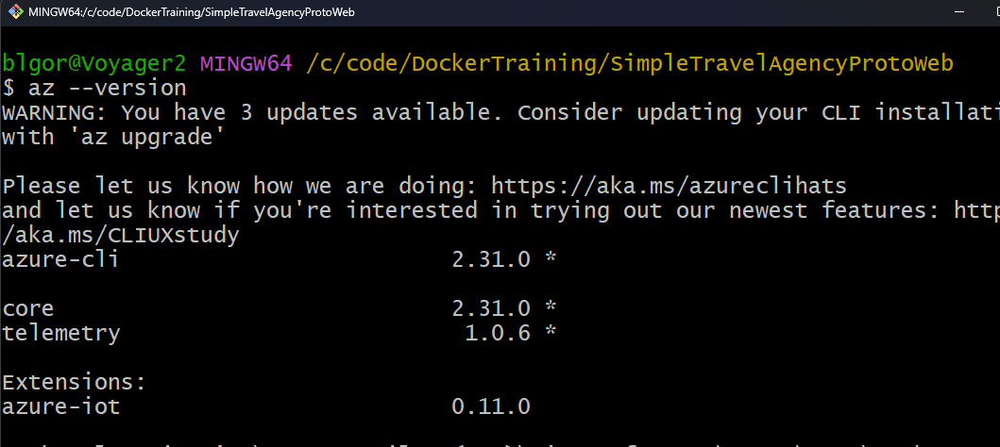
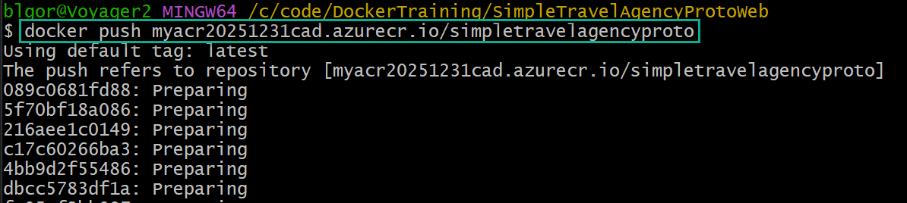
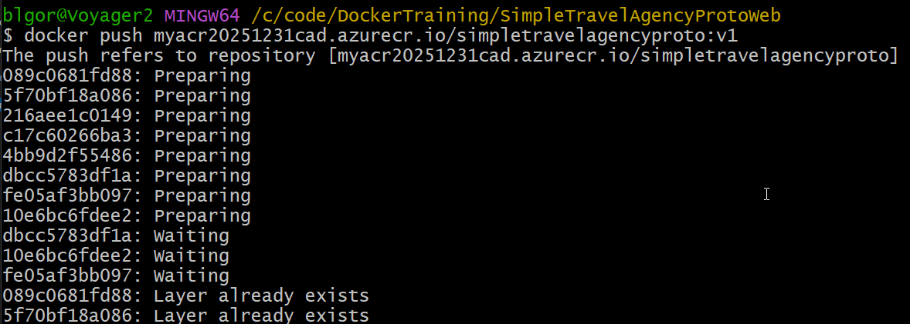
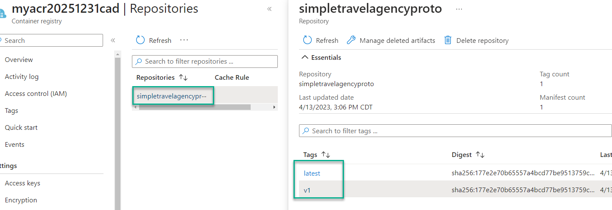
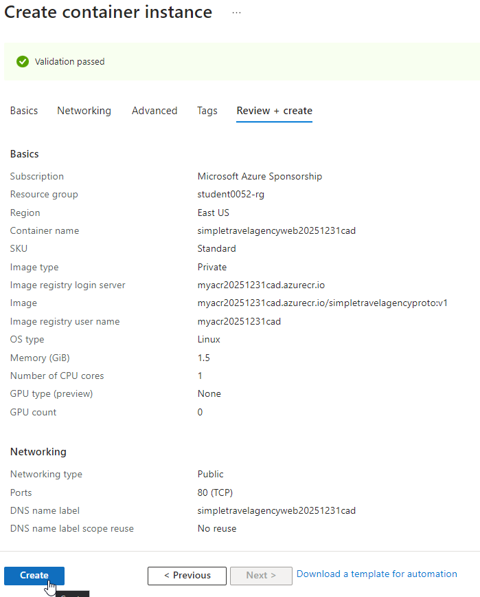

#  Practice Lab: Deploying Containers In Azure

In this guided lab, you'll learn how to provision the necessary resources and then deploy your containerized applications into Azure Container Instances (ACI) via images you build and store in the Azure Container Registry (ACR).

## Prerequisites

In order to make any changes to this code you would need to have a .NET development environment set up.  If you want to do that, you will need to get the tools necessary.  The recommendation would be to just get the latest version of Visual Studio or VSCode on your machine.

For this exercise, you will not need to make any code changes.  For that reason, you can leverage any text-based IDE of choice (i.e. VSCode, IntelliJ, Eclipse, etc).  You may even be able to get away with using notepad or notepad++.

>**Note:** The examples in this lab do use Docker Desktop.  IF you do not have Docker Desktop, you can accomplish the build and push commands necessary from the standard Docker CLI in any terminal.

Must haves to complete this assignment:

1. Any text-based IDE
1. (Windows machines only) Windows Subsystem for Linux (WSL)
1. (Windows machines only) Ubuntu on WSL
1. Docker Desktop (or an ability to run Docker commands locally)
1. Any terminal to run Docker commands.
1. Source Code [found here](./resources/SimpleTravelAgencyProtoWeb.zip)  
1. Azure CLI

> **Important:** By this point in the training, it is assumed you have already learned about and have Docker working on your local machine.  If you do not have Docker and/or you are not able to create and work with images, then you should go back and work through the documents for [Introduction to Docker](03_docker-intro.md), [Docker Commands](05_docker-commands.md), and [How to Dockerize with Dockerfile](06_dockerfile.md).  

### Additional Resources Downloads

In case you need to find other resources, perhaps these will help:

1. If you do not have any editor, just get VSCode.

    - [Download Visual Studio Code](https://code.visualstudio.com/download)  

1. If you are on a windows machine, you will have to have WSL

1. If you do not have `Docker` the easiest way to get it is [Docker Desktop](https://www.docker.com/products/docker-desktop/).

1. If you can't use Docker Desktop (licensing issues), then you will need to just [install docker on Ubuntu](https://docs.docker.com/engine/install/ubuntu/)  

1. Azure CLI [use this link to install it.](https://docs.microsoft.com/en-us/cli/azure/install-azure-cli)  

## Code Along and build out the environment  

In the next few activities, you will build out a containerized application and then work though the steps to deploy the application to Azure Container Instances, with your image hosted on Azure Container Registry.  

As the learning progresses, concepts will build on things already learned and failure to complete any section in order will likely result in the inability to complete consecutive sections.  

Therefore, it is recommended that you do not skip ahead, but rather work through the activities as they are presented.  

> **Note:** The remainder of this work requires access to an Azure subscription.  Do not delete resources after creation as the work builds on itself as it goes.  Only delete resources once you have completed the lab.

## Activity: Build and store container images with Azure Container Registry

This first activity will walk you through getting your application built and deployed to the Azure Container Registry (ACR). 

### Step 1: Get the starter project for working with a .Net web application  

The starter project will be easily accessed from this repository, and will be posted into the slack channel to give the ability to easily download the source file.  

[SimpleTravelAgencyProtoWeb](./resources/SimpleTravelAgencyProtoWeb.zip)    

### Step 2: Extract the contents of the file and build and run the prototype website locally

Before doing anything at Azure,  it's a good idea to ensure that everything works locally.  If you don't have .NET installed, then you won't be able to build and run the code locally.  However, the container will be able to be built and you can still test it out.  How awesome is that?

#### Step 2.a Extract the file  

Extract the starter files to a folder that makes sense on your local machine.  Once the files are extracted, open Visual Studio code to that folder so that you can review the files.  

Additionally, open a Terminal to the folder root where the `SimpleTravelAgencyProtoWeb.sln` file resides.  

  

>**Note:** It is sufficient to open this in WSL or any terminal that can run docker commands


#### Step 2.b Build the local image  

To build the local image, run the following command:  

```bash
docker build -t simpletravelagencyproto .
```  

  

Wait for the command to complete, then validate the image is listed in your `Docker Desktop client`.  

  

> ***Question:*** Do you remember what the docker command is to see your images locally?

Answer:  

```bash  
docker image ls
```  

With the image built, it's time to run it locally and ensure it works.  

#### Step 2.c Run the image locally  

Use the docker start command or utilize Docker Desktop to start a new container based on the image.  Map ports that make sense and don't conflict with anything on your device.  

>**Note:** You will need to expose port 80 in addition to port 443 unless you want to go through the process of installing a local SSL certificate  

Find your image, and use the `Run >` button.  

  

Expand the `optional` settings.  If you would like, you can set a container name, but you do not need to.

Make sure to set the port for 443 to something that is not in use, like `8081`.  

Add a second port for port `80`, set to port `8082` (must also be unique and not in use).  

  

**Run the container** once you have the ports configured correctly. 

##### Alternate to Docker Desktop

If you don't have docker desktop, you can run the container manually:

```bash
docker run -dp 8082:80 simpletravelagencyproto
```  

Once the container is running, you can browse to it just like above using:

```http
http://localhost:8082/
```  

>**Note:** The app may automatically open for you if you run the commands locally without Docker Desktop!

  

#### Step 2.d Ensure the container works locally

To finalize this step, ensure the container works locally.  

On `Docker Desktop`, navigate to your running containers and use the `browse` button to open the container locally in a browser.  

 

>**Note:** If you select the 8081:443 option, this will open to the port 443 instance, which will not work.

  

If you do that, just change the url to `http` and the port to `8092` and you will be able to view the site:

```text
http://localhost:8082
```  

>**Note:** Failure to change https to http will continue to show the site is not working.

  


### Step 3 - Create an Azure Container Registry in the Azure Portal, and push your image to the ACR  

To begin, you will need to log in to your Azure Subscription.  Once you are logged in, you will need to have a resource group where you will create your resources.  

#### Step 3.a - Ensure your resource group

Open the azure portal and browse to the resource groups by typing the following into the search bar at the top

```text
Resource Group
```  

  

Once you are on the Resource Groups listing, ensure a group exists with `Student00XX-rg` as the name of the resource group. (XX is your student number, such as 02, 25, 99, etc). 

  

If no group exists with your name, create one using the `+ Create` prompt at the top menu on the listing.  If you cannot create one, ask your instructor to create a resource group for you.

  

#### Step 3.b - Create the ACR

In this step you will create an Azure Container Registry to store your docker images.

The easiest way to do this is to just open the portal at Azure if you don't already have it open.  

To create an ACR, type the following into the search bar at the top menu in the portal:

```text
Container Registries
```  

Select the `Container registries` item from the dropdown.  

  

At the `Container registries` blade, select `+ Create` to begin the process of creating a new container registry.  

1. Set the `Basics`  

    On the basics blade, select the subscription, and your resource group.  

    For the details, create a registry with a name such as

    ```text
    myacrYYYYMMDDzzz
    ```  

    Replace `YYYYMMDD` with the year, month, and day, and `zzz` with your initials.  This *should* ensure a unique name.  If not, put in another date other than today.  

    Select a region close to you, and change the `SKU` to `Basic`. 

      

    Select `Next: Networking -> `  

1. Review the `Networking` blade.  

    Note that this blade gives you the ability to set a private network.  Private networking is only available on the `Premium` sku.  If you needed to secure your ACR in a private network, you would need the premium tier and you'd have to create a private link to the ACR.

    hit the `Next: Encryption -> ` button.

1. Review Encryption options

    Note that you must use encryption. Your only option here is to leverage your own personal key vs. an Azure-backed key.  Once again, to use your own key, you must be on the Premium SKU.  

    Hit the `Review + create`.  While you could tag any resource, there is no requirement to do so.

1. Review and create the registry.  

    Once validation passes, hit the `Create` button, then wait for the deployment to complete.

    When the deployment completes, hit the `Go to Resource` button.  

    You will then see your ACR is created and ready to be used:

      

    Before going to the next step, you will want to get a couple of pieces of information.  To do this, you will want to enable the Admin user. 

    On the left menu, select `Access Keys`.  When the blade shows, use the slider button to enable the Admin user.  This will give you the admin credentials.  

      

    Note that the registry name and the username are the same.  Note that the Login server is the registry name with `.azurecr.io` at the end.  

    Copy the **username**, **password**, and **login server** for use later.  
    
    For now, just paste into notepad or some other tool that lets you quickly retrieve these values later.  

### Step 3.c - Alias your image and push to the ACR  

In this step you will alias a local image and push the image to the ACR.  You will then create another image with a specific version number and push that to the ACR as well.  

1. Connect to Azure from the command line.  

    With your image created locally, and the ACR created at Azure, it's time to push your image from your local device to the cloud registry.  

    The first step in this process is to get logged into your account, and to make sure you have the Azure CLI installed.  

    Open any powershell, bash, or other terminal.  In order to connect to Azure, you will want to have the Azure CLI installed.  In your terminal/bash/powershell window, run the command:

    ```bash
    az --version
    ```  

    If you have the `Azure CLI` installed, you will see the version number, such as 2.31.0

    Ensure that you see output that indicates you have the Azure CLI installed.  

      

    If you do not have `Azure CLI`, [use this link to install it.](https://docs.microsoft.com/en-us/cli/azure/install-azure-cli)

    You may install on `Bash` or on `Powershell`, whichever flavor you prefer.

    If you are on windows, [this direct link](https://aka.ms/installazurecliwindows) will download the MSI Installer, which you can run to install the Azure CLI on your machine.

    If you are not already signed in, sign in to your Azure account by opening a browser to the [azure portal](https://portal.azure.com):

    ```https
    https://portal.azure.com
    ```  

    You may not need to do this, but this will ensure that when you log in with the az command you will already be signed in on the portal via the browser.

    Run the following command in your terminal:

    ```bash  
    az login
    ```  

    Likely a browser will open and you will need to authenticate.  Once you've authenticated, you'll see information about your subscription.

    

    >**Note:** If you only have one subscription, you can skip to the next step `Log in to your ACR`.

    If you have more than one subscription, ensure that you are on the correct subscription for your account.  

    ```bash
    az account list --out table
    ```

      

    If you have multiple subscriptions, they will be listed.  You can then select the correct subscription.  

    ```bash
    az account set --subscription <your-subscription-id>
    ```  

      

1. Log in to your ACR.

    Now that you have logged in to Azure, ensure you are also logged into your ACR from the terminal.  Using the name of your registry that you copied earlier (your admin username is the same value), run the following command replacing `your-registry-name` with your admin username/registry name

    ```bash
    az acr login --name your-registry-name
    ```  

    If prompted, you may need to enter credentials.  If not, you will immediately see `Login Succeeded`.  

      

3. Create a local alias of the image with the correct information from your Azure Container Registry.  

    To continue, you must build an image that will be able to be pushed to your container registry.  

    Currently, you should have a local image for `simpletravelagencyproto`.  You will need to rebuild the image but ensure that it is aliased and versioned for deployment to your ACR.  
    
    To do this, in the terminal where your Dockerfile is, run the following command (don't forget to set the registry name correctly):  

    ```bash
    docker tag simpletravelagencyproto your-registry-name.azurecr.io/simpletravelagencyproto
    ```  

    Then run the command to list your images and/or review in Docker Desktop.

    ```bash
    docker image ls
    ```  

      

4. Push the image to the ACR.

    With your account connected and the image successfully created, you are finally ready to push to the ACR.  To do this, just run the docker command to push:

    ```bash
    docker push your-registry-name.azurecr.io/simpletravelagencyproto
    ```  

      

    >**Note:** Since the image has no version, the default of `latest` is used.  

    Return to your ACR in the portal and review your images by selecting `Respositories` on the left menu.  You should see your image is now in the ACR and is ready to be deployed to an Azure platform service.  If you click on image in the portal, you can see more information.

      

    Note that this is the latest version.  Since you will likely update this in the future, it is a good practice to create a version tag.  Pointing to the latest can have some adverse effects if someone pushes a new image and it is not backwards compatible with what you are expecting.  

5. Create a new version tag on your local image and push to the ACR.  
   
    In the terminal, run the following command, making sure to replace the name of the ACR with your ACR name as before:

    ```bash
    docker tag simpletravelagencyproto your-registry-name.azurecr.io/simpletravelagencyproto:v1
    ```  

    This is the same command as before with a `v1` tag on the end.  Review your local images:   

    ```bash
    docker image ls
    ```

      

    After you are sure the image is there, push the `v1` version to your ACR with the same command as before and the additional `v1` tag:  

    ```bash
    docker push your-registry-name.azurecr.io/simpletravelagencyproto:v1
    ```

      

    The good news is that this time you don't have to wait for all the layers to push, since you already did that on the first push and nothing has changed.

    Finally, review the repositories in the portal again (you may need to refresh).  Why do you think you only see one image in your repository?  

    Click on the repository to reveal that the answer is that each version is listed on the image blade, not in the repository as a separate image.  

      

### Step 4: Crate the Azure Container Instances (ACI)  

In this step. you will create an Azure Container Instances deployment which leverages your ACR to automatically host the `simpletravelagencyproto` image in a container.  

1. Start the process to create an ACI.  

    In the search at the top of the portal, type `container instances`.  Then select the appropriate item from the dropdown. 

      

    On the `Container instances` blade, select `+ Create` or `Create Container Instances`.  

    Use the following on the `Basics` tab:

    Subscription: `your subscription`  
    Resource Group: `your resource group`  
    Container name: `simpletravelagencywebYYYYMMDDzzz`  
    Region: `your favorite region`  
    Availability zones: `None`   
    SKU: `Standard`  
    Image Source: `Azure Container Registry`  
    Registry: `Select your registry`  
    Image: `simpletravelagencyproto`
    Image tag: `v1`  
    OS Type: `Linux`  
    Size: Leave as is - `1 vcpu, 1.5 GiB memory, 0 gpus`  

    select `Next: Networking >`  

     

    Note the options available on the networking tab.  Note the DNS Label, and note the port mappings.  As expected, port 80 is mapped by default.  

    Add a new DNS name label with `No reuse` scope (note that you must update the following to something unique with only small letters and numbers in the name):

    ```text
    simpletravelagencywebYYYYMMDDzzz
    ```  

     


    Hit the `Next: Advanced >` button.  

    Note how on this tab you can select a restart policy and add additional environment variables, including secure variables. For example, if you needed a database or other connection string here, you could enter it in this location. 

    Finally, note there is a command override to let you execute a command on startup should you want to run some script inside the container.  

    There is no need to change anything, so hit the `Review + create` button.  Once your ACI is validated, hit `Create`.  

      

    Wait for the deployment to complete.  

1. Review the deployed containerized application.

    Once the deployment is successful, you can easily see your application working by browsing to the public IP for your ACI or the DNS name you entered.  

      

    If you browse to the public-facing URL either by IP or by the FQDN at this time, your deployment should be working.  If the deployment is not working, wait a minute or two and try again.   

      

### Step 5: Review the ACI instance.  

This exercise has been a great activity to learn about the ACI when everything works on the happy-path.  However, life is not always so easy.  What do you do if things don't work?  

Take a minute to review the ACI blade in the portal, and look for ways you might be able to see where things are not working.  

At some point, ensure that you click on `Containers`.  This will bring up a very handy review blade.  

  

On this blade, note that the container lifecycle is shown, where you could see if it was started correctly.  Additionally, note the tabs for `Properties` and `Logs`.  Clearly `Logs` would be useful for debugging.  

Select the `Connect` tab to see how you can connect to the running container from within the portal.  

  

Use the `bin/sh` connection to review the internal state of the container. 

  

Now you know that, should the need arise, you can attach to the running container and run linux commands on the container itself for troubleshooting.  

## Additional Resources and Practice  

[Quickstart: Deploy a container instance using the Azure Portal](https://docs.microsoft.com/en-us/azure/container-instances/container-instances-quickstart-portal)  

[Deploy a container application to Azure Container Instances](https://docs.microsoft.com/en-us/azure/container-instances/container-instances-tutorial-deploy-app)  

[Build a containerized web application with Docker](https://docs.microsoft.com/en-us/learn/modules/intro-to-containers/)

[Build and store container images with Azure Container Registry](https://docs.microsoft.com/en-us/learn/modules/build-and-store-container-images/)  
